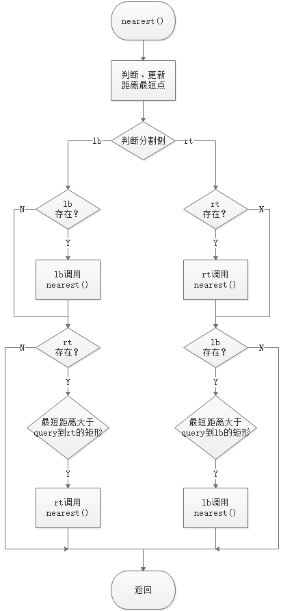

# [Programming Assignment 5: Kd-Trees](http://coursera.cs.princeton.edu/algs4/assignments/kdtree.html)

## 1. 问题重述
这个问题其实就是[Kd-Trees](https://www.coursera.org/learn/algorithms-part1/lecture/Yionu/kd-trees)那节课讲的内容，按照老师的思路来实现就好了。

这个问题就是在一个平面上有N个点，需要实现两个功能。
    
1. 在给定一个平面内区域，让你寻找在区域中点的个数。
2. 给定一个点，寻找离这个点最近的M个点

## 2. 分析

题目要求用两种方法求解，一种暴力方法，一种2d-Tree。

### 2.1 暴力搜索

功能1，将每个点都和需要搜索的区域比较。

功能2，计算给定点和每个点的距离，拿个优先队列存M个。

点的插入、删除使用红黑树，时间就能满足O(logn)。两个功能就是O(N)。

### 2.2 构建2d-Tree

本以为就按照课程讲的做就是了。结果实际写的过程中遇到了好多好多问题。

那这里就把思路详细的写出来了。

2d-Tree是一个变种的BST。

#### 2.2.1 构造Node

包括Node的坐标、Node所在的矩形、Node的左/下子树、Node的右/上子树。

#### 2.2.2 insert函数

插入的时候使用迭代的思想，将新的点插入到一个节点，然后再节点中向对应的子树插入此节点。当遇到空的子树时，插入新点。

*难点1*，由于不同层分割区域的方式不同，所以需要在插入函数中加入一个参数*i*记录所在层，通过*i % 2*来判断分割方式，选择比较对象x或y。

*难点2*，插入时存在两个假设，1.对于落在分割线上的点，假设点分在右/上子树；2.相同坐标的点只插入一次。理清楚这两个假设需要费些时间，要分清分割线上的点，和相同的点。

#### 2.2.3 contain函数

contain函数的搜索过程和insert找插入点的过程一致，需要注意的就是区分相同点和落在分割线上的点。另外要注意的是，不要自己写判断点是否包含在矩形中，直接用矩形的成员函数。

#### 2.2.4 range函数

递归调用，每次先判断range矩形是否在当前Node的矩形里，不在则将当前Node和其子树剪枝。若在矩形里，则继续搜索子树。

#### 2.2.5 nearest函数

重头戏来了，坑了我最久时间的函数。

这个问题最难的点在于
1. 需要判断query点在Node的哪一侧。因为需要从query点所在的一侧开始搜索。
2. 搜索完一侧之后，另一侧是否剪枝。因为Node两侧子树还可能不存在。**而且判题系统不允许自己使用distanceTo来判断点到切割线的距离**，只能使用子树的矩形的contain函数。就需要先判断两侧子树是否存在。

然后我就把自己绕晕在这几个判断条件里了。

现在来清楚的理一下流程。依旧使用递归的方法。

1. 传入节点，将节点和最短节点比较，更新最短节点。这里，第一次使用根节点作为最短节点，并传入根节点。
2. 判断点在哪侧。根据切割方向，将Node里的x/y与query点的x/y来比较。
3. 若在左/下侧，进入流程3。若在右/上侧，进入流程4。
4. 判断左侧是否有节点，如果有节点，将节点传入nearest函数。然后判断右侧是否存在节点，若不存在则直接返回；若存在，则判断左侧距离右侧节点所在矩形的距离是否是否大于最短距离，若大于，则返回，否则搜索右侧。
5. 判断右侧是否有节点，如果有节点，将节点传入nearest函数。然后判断左侧是否存在节点，若不存在则直接返回；若存在，则判断右侧距离左侧节点所在矩形的距离是否是否大于最短距离，若大于，则返回，否则搜索左侧。

流程图如下图所示。

## 3.做题过程中乱七八糟的想法

### 3.1 Kd-Tree是要自己写的，不是用红黑树凑的

### 3.2 怎么确定Kd-Tree的节点是横还是竖

从root向下走，每走一次就是一级，设现在在i级，用i%k就得到了。

### 3.3 如何更新Kd-Tree里的Rectangle

~~每次递归传递这次的矩形，下次根据上下左右裁剪，再作为参数。最后null的时候就用参数里的矩形~~

上面的方法有性能问题，会调用过多的矩形构造函数。考虑用上面的方法是，我是在null节点时才构造新的节点，这样就会造成不知道父节点的矩形，没法根据点的位置构造。

但是，如果在父节点构造新的节点，就不一样了。当父节点发现要构造节点位置为空时，不是进入insert函数，而是在这里构造节点。这样就直到父节点的矩形了，不需要每次都构造矩形。

### 3.4 如何画线

最开始的想法是画Node的矩形，然后发现不对，回少画一条穿过node的线。

实际应该画Node在矩形中的横/竖线。

### 3.5 提交报错

1. [ERROR] PointSET.java:49:28: Do not draw to standard drawing in this program. [SideEffect]

这个还是不读题啊。。。Point2D里有draw这个函数。

### 3.6 仔细读题，Point2D和RectHV好多特性没用上。

**一般情况下，能用标准库、或者类内不得函数就要用！！**

### 3.7 contain遇到在线下边的点，而有个点与线相交，会归为上面的点，先计算矩阵时会算下面的点，而下面点算出来之后，上面就被剪枝了

1. 剪枝条件不是在一侧找到点，就剪掉另一侧。而是一侧点到点的最短距离，小于点到分割的矩形边的距离。（这个题目里有，自己想错了，听过不等于会了）
    1. 跟另一侧的矩形对比，就可以用矩形的成员函数了
2. query点跟rectangle比有可能会左右两边都不包括点，所以应该用线延长到边界，比左右/上下。
3. 注意比较左右节点返回回来的点的距离

