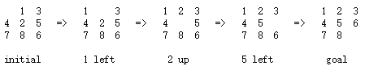
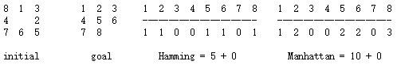
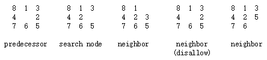
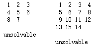
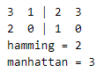

# [Programming Assignment 4: 8 Puzzle](http://coursera.cs.princeton.edu/algs4/assignments/8puzzle.html)
## 问题
### 1. 问题翻译
这回读题读的头大~~（英语差吃亏了）~~，我就先按照自己的理解写下题目的翻译，再写重述性质的内容。

使用A*算法编写一个程序解决各种类型的数字推盘游戏。

**问题**。数字推盘游戏是Noyes Palmer Chapman在1870年发明的一个十分流行的谜题。游戏在一个3×3的网格上进行，包括拥有有1到8标签的8个方块和一个空白块。你的目标时用最小的移动，重排这些方块，使得方块有序。你被允许横向或纵向滑动方块到空白快。下图展示了一个从初始推盘（左侧）到目标推盘（右侧）的合法移动序列。

**最优搜索**。现在我们描述一种叫做A*搜索算法的通用人工智能方法。我们定义一个推盘为搜索节点，到达此推盘所要经历的移动数目和其前一个搜索节点。首先，插入初始搜索节点（初始搜索节点，0移动，前一个搜索节点为null）进入优先队列。然后，删除优先队列中优先权最低的节点，然后将这个优先权最低的节点的所有邻居节点（从此节点通过一次移动可以到达的搜索节点）插入到优先队列中。重复这个步骤，直到从优先队列中删除的节点为目标节点是停止。这个方法的成功取决于如何为搜索节点选择优先函数。我们考虑两种优先函数。

* Hamming优先函数。在错误位置的块加上到目前块位置所经历的移动。直观上，一个拥有少的错误位置块的搜索节点将更靠近目标，并且我们期望一个搜索节点能用少的移动到达目的。
* Manhattan优先函数。从当前推盘到目标推盘各个块的曼哈顿距离（到达目标点的横向和纵向距离和）距离和，加上到当前搜索节点的移动距离。

例如，下图初始搜索节点的Hamming和Manhattan优先权分别为5和10。

让我们来看一看。一个给定的搜索点优先队列求解这个问题，我们需要去移动的总的移动数目（包括已经走的）至少是使用Hamming或Manhattan计算的优先权（对于Hamming优先权，因为错误的块至少需要一次移动才能到达目标位置，所以是对的。对于Manhattan优先权，因为没有个块必须移动曼哈顿距离才能到达目标位置，所以是对的。注意，我们计算Hamming和Manhattan优先权是不计算空白块）。因此，当目标块出队时，我们找到的不仅仅是从初始块到目标块的路线，也是最短移动路线。（挑战：数学证明）

**关键优化**。最有搜索哟路一个恼人的特性：搜索节点和其相同的节点被入队许多次。为了减少不必要的无用搜索节点，当考虑搜索节点的邻居时，不要将与前一次搜索节点相同的邻居节点入队。

**第二个优化**。为了避免在许多优先队列操作中重新计算搜索节点的Manhattan优先权，在构造搜索节点时就计算，将他保存在一个实例变量中，然后在需要时返回保存的值。这项缓存技术是官方使用的：当你需要重新大量计算相同的数和计算量是瓶颈是可以使用。

**博弈树**。博弈树是观看计算过程的一个方法。在博弈树中，每一个搜索节点是一个博弈树节点，并且其子节点和其邻居搜索节点相同。博弈树的跟节点是初始搜索节点；内部节点已经被处理；叶节点被加入到优先队列；每一步，A*算法将从优先队列中移出最小优先权的节点并且处理它（通过将它的子节点加入到博弈树和优先级队列中)。

**检测不可解谜题**。并不是所有的初始节点都可以通过一系列的合法移动求出目标节点，包括以下两种情况。

为了检测这些情况，使用以下两个事实，推盘被分为两个等价的种类（use the fact that boards are divided into two equivalence classes with respect to reachability: ）。其一，通向目标节点的，其二，那些通过交换初始节点任何块（不包括空白块）通向目标节点的。（挑战：数学上证明）。为了应用这个事实，在两个谜题实例上运行A*算法，一个初始推盘，一个在初始推盘上交换过块的推盘（one with the initial board modified by swapping a pair of blocks—in lockstep (alternating back and forth between exploring search nodes in each of the two game trees).）。其中一个将会到达目标。

剩下的都是关于如何代码API、性能需求、边角案例等的，就不翻译了。

### 2. 问题重述
自己重新写一下翻译之后，发现基本如何实现已经写清楚了。。当时英语看的迷迷糊糊的，挺多实现还是自己想的。哎。

通过程序实现一个数字推盘游戏，推盘有n*n个块，其中有一个空白块，其他块拥有1到n^2-1的编号。空白块边上的块可以通过水平或垂直移动移到空白块，最终使推盘内部编号有序排列。

具体实现方法如题目中所说，首先，建立一个搜索节点的数据结构，其中包含当前块，移动到当前块的上一个块，移动到当前块总共经历的移动次数。其次，每次列出当前搜索节点能够变化的邻居节点，然后将其中与前一次搜索节点不同的邻居块加入到一个优先队列。最后，将优先队列中优先权最小的搜索节点移出优先块，作为搜索节点。循环直到找到目标有序推盘。

这里优先权的计算有两种方法，具体见题目。

## 分析
有两个类需要实现，Board类和Solver。

### 1. [Board类](8puzzle/Board.java)
Board类用来表示一个推盘。推盘包括一些重要的数据，推盘的维数、推盘的hamming，Manhattan、推盘是否到达目标。这里为了记录空白块位置，还加入了两个整形来记录空白块。

Board构造函数，为了记录传递过来的二维数组，这里建立了一个二维数组成员，期望拷贝传递的二维数组。但是发现java的clone函数不能的拷贝二维数组，所以就自己实现了一个函数，用来拷贝二维数组。

计算hamming，就是遍历整个推盘，如果所在位置的数值和预想值不同，则hamming加一。

计算Manhattan，遍历整个推盘，计算推盘所在位置数值的行和列与预想的行和列的差值。这里记得差值要取绝对值。

生成双胞胎推盘，按照题目的要求，这里需要生成一个只交换两个块的双胞胎推盘。翻译的时候发现，好像题目是期望你将推盘第一个和最后一个非空给交换。我采用的方法是将推盘左上角，右上角，左下角其中非空的两个交换。最开始是将第一行的前三个交换，但是如果维度小于3就失败了，然后选择了这个交换方法。

判断相等函数。参考书上的例子，首先判断输入是不是自己，是的话相等。第二，判断输入是否为空，为空则不等。第三，判断两个对象是不是同一种类，如果不是则不等。第四，将输入对象朱鹮为Board类，判断类中的维度，hamming，Manhattan是否相等。我本来以为这种情况就相等了，但是仔细想了想，这些相等也不一定等，下图的例子就是不等的。如果这三个值有不等的，则认为不等。最后，将两个Board类的块一个一个比较，判断是否相等。

### 2.[Solver类](8puzzle/Solver.java)

SearchNode类。这个类记录搜索节点数据，按照题目要求，应该包含当前块，移动到当前块的上一个块，移动到当前块总共经历的移动次数。我还添加了优先级的记录。

构造函数中，根据初始节点构造两个搜索节点，一个使用初始节点，一个使用初始节点的双胞胎节点。然后按照问题重述中的循环搜索目标节点，直到这两个节点其中一个找到目标节点为止。若可解，根据当前搜索节点向前搜索，构造求解顺序，最后记得将初始节点加上。